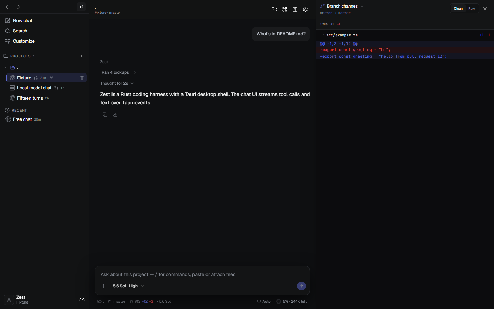

# Zest

**A local-first coding workspace for your preferred AI providers.**

Work on a repository, review changes, and delegate scoped tasks to separate workers when you need them.

[Install the beta](https://github.com/LemonMantis5571/Zest-Harness/releases) · [Build from source](#build-from-source) · [Docs](#docs)

*Offline demo with synthetic conversation and changes.*

## Install the beta

Packages live on [GitHub Releases](https://github.com/LemonMantis5571/Zest-Harness/releases).

- **Windows 10/11 x64.** `.msi` or `.exe`
- **Linux x64.** `.deb`, `.rpm`, or AppImage
- **Standalone `zest` CLI.** Linux and Windows binaries without WebKit, for
  `zest serve` and the terminal client

Each release includes `SHA256SUMS` and third-party notices.

## Your first task

1. Launch Zest and use **Choose a provider** to connect an existing sign-in or API key.
2. Open your repository with **Open** beside **Project folder**.
3. Continue into the chat and try:

   > Explain this repository and suggest one small improvement. Do not change files yet.

4. Once you understand the suggestion, ask Zest to implement it. Respond to any
   approval requests, then open the branch changes bar above the composer to
   review the diff. Ask it to run the relevant tests before you keep the change.

See [Getting started](docs/GETTING_STARTED.md) for connection choices, an example
workflow, and help with setup.

## Choose your connection

| Connection | What you bring |
| --- | --- |
| Coding CLI | An installed, supported CLI and its existing sign-in |
| Native API | Your provider's API credentials |
| OpenAI-compatible endpoint | A base URL, model ID, and credentials required by that endpoint |

The model control in the composer selects from your connected providers. Your
main conversation stays with its selected provider; delegation is optional.
Desktop and terminal share the same core and recoverable conversations.

## Delegate a scoped task

Use a **feature card** when you want a separate worker to handle part of the
project. Give it an objective, scope, selected context and acceptance checks,
then select a worker and reviewer. The coordinator manages the queue and retries.

- **Native provider workers** run through Zest's provider runtime.
- **External workers** use a configured ACP session or a signed-in CLI, keeping
  their own credentials and sessions.

Review happens in a fresh workspace. A validated review report makes a job ready
to apply. Your main conversation stays with its provider.

A VM or editor host can run [`zest serve`](docs/SERVE.md) as the coordinator
without a display.

## Local-first

Config lives at `~/.zest`. Provider credentials use the OS credential manager
when available, and usage is recorded per provider. Requests and selected
context are sent to the provider you connect; local-first does not mean every
model runs on your machine.

Optional plugins install as separate processes. See [Plugins](docs/PLUGINS.md)
and [provider quota](docs/QUOTA.md).

## Build from source

See [`CONTRIBUTING.md`](CONTRIBUTING.md) for the pinned toolchain, Linux packages, and local verification gate.

## Platforms

| Platform | Status |
| --- | --- |
| Windows 10/11 x64 | Beta installer and CI-verified |
| Linux x64 | Beta packages and CI-verified |
| Windows/Linux ARM64 | Source builds only |
| macOS | Source paths exist; CI and installers are not available yet |

## Security

Writes, commands, and delegated jobs are gated before they run. An approved command still runs with your OS permissions. Install only plugins you trust.

## Docs

- [Getting started](docs/GETTING_STARTED.md). Connect a provider and complete your first task.
- [Plugins](docs/PLUGINS.md). Install, build, protocol, and review standard.
- [Skills](docs/SKILLS.md). Personal skills and install locations.
- [MCP servers](docs/MCP.md). Outbound servers the parent chat can call.
- [Coordinator daemon](docs/SERVE.md). `zest serve` inbound MCP.
- [Provider quota](docs/QUOTA.md). Live limits, balances, and local usage.
- [Contributing](CONTRIBUTING.md). Development, tests, and pull requests.
- [Contributors](CONTRIBUTORS.md). People who have contributed to Zest.
- [Releasing](docs/RELEASING.md). Maintainer release checklist.
- [Changelog](CHANGELOG.md). User-facing changes.
- [Security policy](SECURITY.md). Vulnerability reporting.
- [Third-party notices](THIRD_PARTY_NOTICES.md). Dependency attribution.

## Contributors

- [LemonMantis5571](https://github.com/LemonMantis5571)
- [rjamador](https://github.com/rjamador)

## Contributing

Read [`CONTRIBUTING.md`](CONTRIBUTING.md), keep each change scoped to one
behavior, and include tests for behavior changes. Report security
vulnerabilities privately using
[`SECURITY.md`](SECURITY.md).

Zest is released under the [MIT License](LICENSE).

## Inspiration

Zest is inspired by Comet's branch-diff review, T3 Cursor's provider and session separation, and DeepSeek Harness's chat workflow. Its desktop UI uses shadcn/ui and ReUI components, restyled with Zest's own design tokens.
