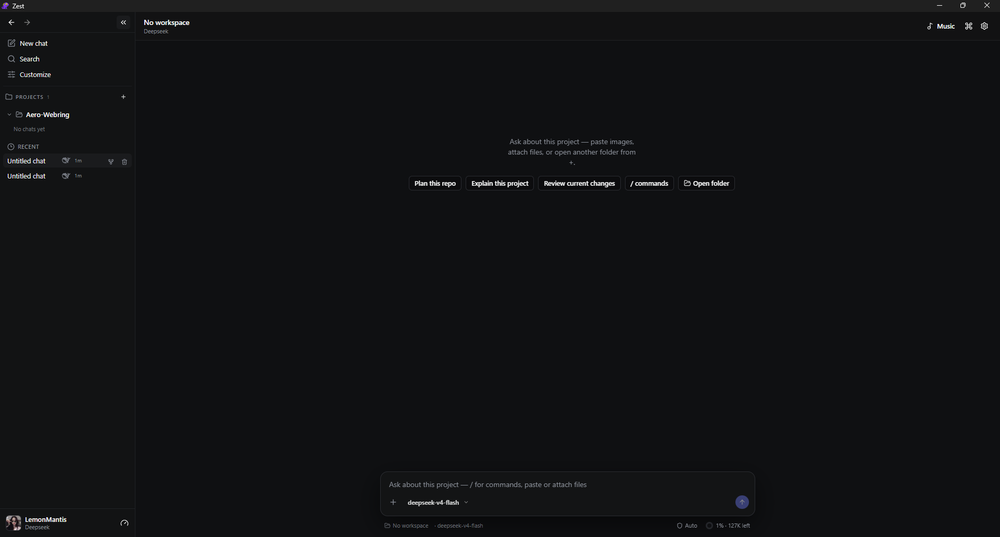

<div align="center">


# Zest

[](https://github.com/LemonMantis5571/Zest/actions/workflows/windows-verify.yml)
[](https://github.com/LemonMantis5571/Zest/actions/workflows/linux-verify.yml)
[](https://github.com/LemonMantis5571/Zest/releases)
[](LICENSE)

**A local coding agent that shows the diff before it writes.**

Desktop and terminal. Your providers, your keys. No Zest account and no
telemetry to a Zest server.

[Install the beta](https://github.com/LemonMantis5571/Zest/releases/latest) ·
[Build from source](#build-from-source) · [Docs](#docs)



</div>

## Why Zest

- **Review before it runs.** Inspect proposed file diffs and commands, then
  approve them.
- **Desktop and CLI.** Use the Tauri app or the `zest` terminal client.
- **Your providers.** Use native APIs, OpenAI-compatible endpoints, or an
  authenticated coding CLI. Credentials, history, and usage stay separate per
  provider.
- **Local history.** Keep project chats and checkpoints across restarts.
- **Honest usage.** Track local requests and tokens without presenting them as
  a provider balance. Show provider-reported limits only when an official,
  supported source is available.
- **Optional delegation.** Send a job to a worker or an external coding CLI,
  review the returned diff in a fresh workspace, and apply it only after
  approval.
- **Optional plugins.** Add local integrations without rebuilding Zest.

| | Zest | [Cline](https://github.com/cline/cline) | [Aider](https://github.com/Aider-AI/aider) |
| --- | --- | --- | --- |
| Interface | Desktop app + CLI | VS Code + CLI | Terminal |
| Before a write | Diff and command approval | Per-action approval | Git commit |
| Account | None, use your keys | None, use your keys | None, use your keys |

## Influences and UI foundations

Zest is inspired by Comet's branch-diff review, T3 Cursor's provider and session
separation, and DeepSeek Harness's chat workflow. Its desktop UI uses shadcn/ui
and ReUI components, restyled with Zest's dark color tokens.

## Install the beta

Open the [latest Zest beta release](https://github.com/LemonMantis5571/Zest/releases/latest).

- **Windows x64.** Install the `.msi` or `.exe` package.
- **Linux x64.** Install the `.deb` or `.rpm` package, or run the AppImage.

Each release includes a platform-specific `SHA256SUMS` file and third-party
notices.

### First session

1. Launch Zest.
2. Choose a provider in **Settings**.
3. Open a project folder.
4. Start a chat and inspect the proposed changes or commands before they run.

## Build from source

Install Rust 1.97.1, Node.js 24.16.0, npm, Git, and PowerShell (`pwsh` on
Linux or macOS). Linux also needs the desktop libraries listed in
[`CONTRIBUTING.md`](CONTRIBUTING.md).

### Windows PowerShell

```powershell
npm ci
npm run dev
```

### Linux or macOS

```bash
npm ci
npm run dev
```

Build the terminal client with Cargo:

```bash
cargo run -p zest -- --help
```

Run the full local verification gate with:

```powershell
.\scripts\release-verify.ps1
```

## Plugins

Official Zest packages do not include plugins. Plugins are installed separately
as folders under the user's Zest plugin directory.

1. Open **Customize > Extras**.
2. Press **Open folder**.
3. Copy one complete plugin folder into the folder that opens.
4. Press **Refresh**, then **Turn on**.

On Windows, the folder is:

```text
%LOCALAPPDATA%\Zest\plugins
```

Install the included Windows music plugin from the repository root with:

```powershell
powershell -ExecutionPolicy Bypass -File .\scripts\install-now-playing-plugin.ps1
```

The install guide, plugin protocol, security rules, and acceptance
checklist are in [`docs/PLUGINS.md`](docs/PLUGINS.md).

## Providers and usage

Zest stores user configuration at `~/.zest/zest.toml`. Supported provider
credentials use the operating system credential manager when available; do not
put secrets in project files or commit them to Git.

Zest keeps these values separate:

- local usage recorded by Zest;
- rate limits returned by a provider; and
- account balances or subscription limits owned by a provider.

The quota panel only shows provider-reported data. See the
[quota guide](docs/QUOTA.md) for provider-specific behavior.

## Platforms

| Platform | Status |
| --- | --- |
| Windows 10/11 x64 | Beta installer and CI-verified |
| Linux x64 | Beta packages and CI-verified |
| Windows/Linux ARM64 | Source builds only |
| macOS | Source paths exist; CI and installers are not available yet |

## Security

Zest's approval layer makes proposed writes and commands visible before
execution. An approved command still runs with the user's operating-system
permissions; Zest is not an operating-system sandbox.

Plugins run as separate child processes, but the plugin boundary is not a
sandbox either. Install only plugins whose source and behavior are trusted.

Delegation is explicit and local-first. The selected parent provider remains
the owner of the parent conversation; delegation does not silently switch the
parent provider or inject the parent transcript into a worker. External CLIs
keep their own credentials and sessions. The coordinator owns the project-local
job boundary, queue and retry rules, reviewer isolation, and usage accounting
model.

## Docs

- [Plugins](docs/PLUGINS.md). Install, build, protocol, and review standard.
- [Skills](docs/SKILLS.md). Personal skills and install locations.
- [MCP servers](docs/MCP.md). Zest's own servers and how they differ from `allow_mcp`.
- [Provider quota](docs/QUOTA.md). Live limits, balances, and local usage.
- [Contributing](CONTRIBUTING.md). Development, tests, and pull requests.
- [Design notes](DESIGN.md). Product and architecture context.
- [Releasing](docs/RELEASING.md). Maintainer release checklist.
- [Beta release notes](docs/releases/0.1.0.md). Scope and known limits.
- [Changelog](CHANGELOG.md). User-facing changes.
- [Security policy](SECURITY.md). Vulnerability reporting.
- [Third-party notices](THIRD_PARTY_NOTICES.md). Dependency attribution.

## Contributing

Read [`CONTRIBUTING.md`](CONTRIBUTING.md), keep each change scoped to one
behavior, and include tests for behavior changes. Report security
vulnerabilities privately using
[`SECURITY.md`](SECURITY.md).

Zest is released under the [MIT License](LICENSE).
